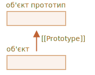
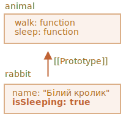

# Успадкування через прототипи

У програмуванні ми часто хочемо щось взяти і доповнити чи розширити.

Наприклад, ми маємо об’єкт `user` з його властивостями та методами, і хочемо створити `admin` та `guest` як дещо змінені варіанти об’єкта `user`. Тобто ми хочемо повторно використовувати те, що ми маємо в `user`, але також додати ще власні методи і властивості. Інакше кажучи, просто хочемо збудувати новий об’єкт поверх того, що існує.

*Успадкування через прототипи* -- це те, що нам допоможе в цьому.

## Спеціальна властивість [[Prototype]]

В JavaScript, об’єкти мають спеціальну приховану властивість `[[Prototype]]` (як зазначено в специфікаціях мови), яка може приймати значення: або `null`, або мати посилання на інший об’єкт. Цей об’єкт називається "прототип":



Коли ми зчитуємо якусь властивість об’єкта `object`, але її не має, JavaScript автоматично бере її з прототипу. В програмуванні це називається "успадкування через прототипи". В скорому часі, ми вивчимо багато прикладів такого успадкування, як і створення більш цікавих прикладів, які побудовані на їх основі.

Така властивість `[[Prototype]]` є внутрішньою та прихованою, але є багато шляхів щоб її визначити.

Одним з них є використання спеціального імені `__proto__`, наприклад:

```js run
let animal = {
  eats: true
};
let rabbit = {
  jumps: true
};

*!*
rabbit.__proto__ = animal; // тут встановлюємо rabbit.[[Prototype]] = animal
*/!*
```

І тепер, якщо ми зчитуємо властивість з об’єкта `rabbit`, а її немає, то JavaScript автоматично візьме її з `animal`.

Ось ще приклад:

```js
let animal = {
  eats: true
};
let rabbit = {
  jumps: true
};

*!*
rabbit.__proto__ = animal; // (*)
*/!*

// тепер ми можемо знайти обидві властивості в об’єкті rabbit:
*!*
alert( rabbit.eats ); // true (**)
*/!*
alert( rabbit.jumps ); // true
```

В позначеному `(*)` рядку, об’єкт `animal` визначається як прототип для об’єкта `rabbit`.

І коли `alert` намагається прочитати властивість `rabbit.eats` (рядок позначено `(**)`), а її там немає, то JavaScript йде за посиланням `[[Prototype]]` та знаходить її в об’єкті `animal` (дивіться знизу вверх):


Ми можемо сказати, що "`animal` є прототипом для `rabbit`", або "об’єкт `rabbit` успадковує властивості об’єкта `animal`".

Якщо `animal` має багато корисних властивостей та методів, вони стають автоматично доступними для `rabbit`. Такі властивості називаються "успадкованими".

Також, якщо ми маємо методи в `animal`, то вони можуть бути викликані і в `rabbit`:

```js run
let animal = {
  eats: true,
*!*
  walk() {
    alert("Тварина йде");
  }
*/!*
};

let rabbit = {
  jumps: true,
  __proto__: animal
};

// тут метод walk береться з прототипу
*!*
rabbit.walk(); // отримуємо "Тварина йде"
*/!*
```

Методи автоматично беруться з прототипу, як тут:


Ланцюг прототипів може бути навіть довшим:

```js run
let animal = {
  eats: true,
  walk() {
    alert("Тварина йде");
  }
};

let rabbit = {
  jumps: true,
*!*
  __proto__: animal
*/!*
};

let longEar = {
  earLength: 10,
*!*
  __proto__: rabbit
*/!*
};

// Метод walk беремо з ланцюжка прототипів
longEar.walk(); // отримуємо "Тварина йде"
alert(longEar.jumps); // true (береться з об’єкта rabbit)
```


І тепер, якщо ми хочемо взяти метод з об’єкта `longEar`, а його там немає, JavaScript буде шукати його в `rabbit`, далі в `animal`.

Існує два обмеження:

1. Посилання через прототипи не може бути замкнено в кільце. JavaScript видасть помилку, якщо ми визначемо `__proto__` в ланцюжку прототипів і замкнем його в кільце.
2. Значення `__proto__` може бути, або посиланням на об'єкт, або `null`. Інші типи значень - ігноруються.

Хоч це і очевидно, але все ж таки: може бути тільки одна властивість `[[Prototype]]`. Об’єкт не може успадковувати властивості та методи від двох прототипів одночасно.


```smart header="`__proto__` є старим і давнім getter/setter для `[[Prototype]]`"
Вважається поширеною помилкою, особливо для початківців, неможливість чітко визначити різницю між двома поняттями `__proto__` та `[[Prototype]]`.

Будь ласка зауважте, що властивість `__proto__`  *не є тою самою* властивістю як внутрішня властивість `[[Prototype]]`. Це є `getter/setter` для `[[Prototype]]`. Пізніше ми побачимо ситуації, коли це важливо, а поки що давайте просто мати це на увазі, примножуючи своє розуміння мови JavaScript.

Властивість `__proto__` вважається трохи застарілим. Вона існує з історичних причин, сучасна мова JavaScript пропонує використовувати функцію `Object.getPrototypeOf/Object.setPrototypeOf` замість `get/set` прототипу. Ми також розглянемо ці функції пізніше.

Згідно зі специфікацією мови, `__proto__` повинно тільки підтримуватись в браузерах. Проте насправді, усі середовища, включаючи серверні, підтримують `__proto__`, а тому використовувати його можна досить безпечно.

Оскільки позначення `__proto__` більш інтуїтивно зрозуміліше, ми будемо його використовуємо в прикладах.
```

## Операція по запису/видаленню не застосовується на прототипах

Прототипи можна використовувати тільки для зчитування властивостей.

А такі операції як запис/видалення, працюють напряму тільки на самому об’єкті.

У прикладі нижче, ми визначаємо власний метод `walk` для об’єкта `rabbit`:

```js run
let animal = {
  eats: true,
  walk() {
    /* цей метод не буде використаний об’єктом rabbit */
  }
};

let rabbit = {
  __proto__: animal
};

*!*
rabbit.walk = function() {
  alert("Кролик! Скік-скік!");
};
*/!*

rabbit.walk(); // тут отримаємо 'Кролик! Скік-скік!'
```

Як тільки ми задаємо метод таким чином `rabbit.walk()`, виклик одразу знайде його на самому об’єкті та виконає без використання такого самого методу, який визначений в прототипі:


Властивості 'Accessor' є винятком, оскільки присвоєння обробляється функцією встановлення (через 'setter'). Отже, запис у таку властивість насправді те саме, що виклик функції.

З цієї причини `admin.fullName` коректно працює в коді, що показаний нижче:

```js run
let user = {
  name: "John",
  surname: "Smith",

  set fullName(value) {
    [this.name, this.surname] = value.split(" ");
  },

  get fullName() {
    return `${this.name} ${this.surname}`;
  }
};

let admin = {
  __proto__: user,
  isAdmin: true
};

alert(admin.fullName); // John Smith (*)

// відпрацьовує setter
admin.fullName = "Alice Cooper"; // (**)

alert(admin.fullName); // Alice Cooper, стан об’єкта admin було змінено
alert(user.fullName); // John Smith, стан об’єкта user захищено
```

Тут на рядку позначеному `(*)`, властивість `admin.fullName` викликається через getter, визначений в прототипі `user`. А на рядку позначеному `(**)` властивість задається через setter, який також визначений в прототипі.

## Значення ключового слова "this"

Цікаве питання може виникнути в прикладі вище: яке значення ключового слова `this` всередині `set fullName(value)`? Де визначаютья властивості `this.name` та `this.surname`: в об’єкті `user` чи `admin`?

Відповідь проста: на `this` не впливає прототип узагалі.

**Незалежно від того, де метод визначений: в об’єкті чи його прототипі, ключове слово `this` завжди вказує на об’єкт перед крапкою.**

Таким чином, виклик в методі `set` виразу `admin.fullName=` буде брати як `this` значення властивостей з об’єкту `admin` а не `user`.

В дійсності це є дуже важлива річ бо наприклад, ми можемо мати дуже великий об’єкт з багатьма методами, і також маємо об’єкти, які успадковують властивості або методи від того великого об’єкту. Коли успадковані методи викликаються на стороні об’єктів, що їх успадкували, вони можуть змінювати тільки свої стани а не стан того великого об’єкту.

У цьому прикладі, об’єкт `animal` представляє "набір методів", а об’єкт `rabbit` може використовувати якісь з цих методів.

Виклик `rabbit.sleep()` встановлює `this.isSleeping` в об’єкті `rabbit`:

```js run
// об’єкт animal має набір методів has
let animal = {
  walk() {
    if (!this.isSleeping) {
      alert(`Я ходжу`);
    }
  },
  sleep() {
    this.isSleeping = true;
  }
};

let rabbit = {
  name: "Білий кролик",
  __proto__: animal
};

// змінює тільки свій стан методом rabbit.isSleeping
rabbit.sleep();

alert(rabbit.isSleeping); // true
alert(animal.isSleeping); // undefined (немає такої властивості в прототипі)
```

Остаточний вигляд:



Якщо ми маємо інші об’єкти: `bird`, `snake` тощо, які успадковані від об’єкта `animal`, вони також будуть мати доступ до методів `animal`. Кожний раз, при виклику будь-якого методу, ключове слово `this` буде вказувати на той об’єкт, на стороні якого був викликаний цей метод, а не на об’єкт `animal`. Отже, коли ми записуємо будь-які дані в `this`, вони зберігаються в об’єктах на які і вказує `this`.

Як результат, методи можуть успадковуватись (передаватись), але стани об’єктів - не можуть.

## Цикл for..in

Цикл `for..in` також може проходитись по успадкованим властивостям.

Наприклад:

```js run
let animal = {
  eats: true
};

let rabbit = {
  jumps: true,
  __proto__: animal
};

*!*
// Object.keys повертає тільки власні ключі
alert(Object.keys(rabbit)); // jumps
*/!*

*!*
// Цикл for..in повертає як власні так і успадковані ключі
for(let prop in rabbit) alert(prop); // jumps, потім eats
*/!*
```

Якщо це не те, що нам потрібно, і ми б хотіли виключити отримання успадкованих значень, існує вбудований метод [obj.hasOwnProperty(key)](https://developer.mozilla.org/en-US/docs/Web/JavaScript/Reference/Global_Objects/Object/hasOwnProperty), який повертає `true` якщо `obj` має тільки власні (не успадковані) властивості.

Отже, ми можемо відфільтрувати успадковані властивості (чи щось зробити з ними інше):

```js run
let animal = {
  eats: true
};

let rabbit = {
  jumps: true,
  __proto__: animal
};

for(let prop in rabbit) {
  let isOwn = rabbit.hasOwnProperty(prop);

  if (isOwn) {
    alert(`Наш: ${prop}`); // Наш: jumps
  } else {
    alert(`Успадковано: ${prop}`); // Успадковано: eats
  }
}
```

У цьому прикладі ми маємо наступний ланцюжок: `rabbit` успадковує властивості від об’єкта `animal`, який, у свою чергу, успадковує властивості від глобального `Object.prototype` (тому що `animal` типово є літералом об’єкта `{...}`) і на самому верху маємо `null`:


Зауважте одну цікаву річ: звідки взагалі взявся метод `rabbit.hasOwnProperty`? Ми його не визначали. Дивлячись на ланцюжок успадкувань ми можемо побачити, що його визначення йде від `Object.prototype.hasOwnProperty`. Інакше кажучи, він успадковується.

...але чому метод `hasOwnProperty` не визначає в циклі `for..in` властивості `eats` та `jumps`, якщо сам цикл `for..in` ітерує або проходить по цим успадкованим властивостям?

Відповідь проста: вони позначені (кажемо стоять під прапорцем) як такі, що не рахуються (not enumerable) так само як і інші властивості в глобальному об’єкті `Object.prototype`. Прапорець у цьому випадку стоїть як `enumerable:false`, а цикл `for..in` тільки зчитує властивості, які визначені як такі, що перераховуються. Ось чому і решта властивостей глобального об’єкту `Object.prototype` не зчитуються також.

```smart header="Майже всі інші методи по отриманню пар ключ/значення ігнорують успадковані властивості"
Отримання пар ключ/значення в інших методах, таких як: `Object.keys`, `Object.values` тощо, ігнорують успадковані властивості.

Методи працюють тільки на самому об’єкті. Властивості від прототипів *не* беруться до уваги.
```

## Підсумки

- В JavaScript, усі об’єкти мають приховану властивість `[[Prototype]]`, яка може бути іншим об’єктом або `null`.
- Ми можемо використати `obj.__proto__` для доступу до цієї властивості (це історичний getter/setter; є й інші методи, які розглянемо згодом).
- Об’єкт, на який посилається властивість `[[Prototype]]` називається "прототип".
- Якщо ми хочемо прочитати властивості об’єкта `obj` чи викликаємо метод, який не існує, тоді JavaScript намагається знайти їх в прототипі.
- Операції по запису/видаленню здійснюються безпосередньо на об’єкті. Ці операції не використовують прототипи (припускаючи, що це властивість даних, а не setter).
- Якщо ми викликаємо `obj.method()`, і при цьому, `method` береться з прототипу, ключове слово `this` вказує на `obj`. Таким чином, методи завжди працюють з поточним об’єктом, навіть, якщо ці методи успадковані.
- Цикл `for..in` ітерує як по власних властивостям так і по успадкованих. Усі інші методи з отримання пар ключ/значення діють тільки на власних об’єктах.
