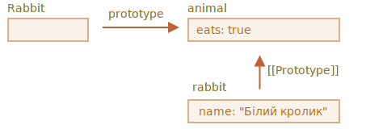
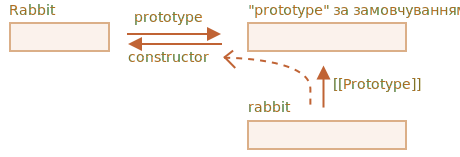

# F.prototype

Як відомо, ми можемо створювати нові об’єкти за допомогою функції-конструктора, ось так `new F()`.

Якщо в `F.prototype` міститься об'єкт, то оператор `new` автоматично встановлює той об'єкт в `[[Prototype]]` для новоствореного об’єкта.

```smart
JavaScript використовувала прототипне наслідування з моменту своєї появи. Це одна з особливостей цієї мови.

Але раніше, в давні часи, прямого доступу до прототипа в об'єкта не було. Надійно працювала лише властивість "prototype" функції-конструктора, описане в цьому розділі. Тому ця властивість використовується в багатьох скриптах.
```

Зауважте, що `F.prototype` тут є звичайною властивістю, яку назвали `"prototype"` в об’єкті `F`. Це звучить дуже співзвучно з терміном "prototype", але тут це означає всього лиш звичайне ім’я властивості.

Ось приклад:

```js run
let animal = {
  eats: true
};

function Rabbit(name) {
  this.name = name;
}

*!*
Rabbit.prototype = animal;
*/!*

let rabbit = new Rabbit("Білий кролик"); //  rabbit.__proto__ == animal

alert( rabbit.eats ); // true
```

Вираз `Rabbit.prototype = animal` дослівно означає наступне: "коли буде створено `new Rabbit`, його властивість `[[Prototype]]` має посилатись на об'єкт `animal`".

Ось кінцева картинка:



На картинці, `"prototype"` що зображена біля горизонтальної стрілки - це звичайна властивість, а `[[Prototype]]`, що зображена біля вертикальної стрілки - вказує на те, що `rabbit` успадковує властивості від свого прототипа `animal`.

```smart header="`F.prototype` використовується тільки у в момент виклику функції-конструктора `new F`"
`F.prototype` використовується тільки при виклику `new F` і присвоюється в якості властивості `[[Prototype]]` нового об'єкта.

Якщо після створення властивість `F.prototype` зміниться (`F.prototype = <інший об'єкт>`), то нові об'єкти, створені з допомогою `new F`, будуть мати в якості `[[Prototype]]` інший об'єкт, а вже існуючі об'єкти будуть посилатись на старий.
```

## Типове значення F.prototype, властивості конструктора

Кожна функція за замовчуванням має властивість `"prototype"`, навіть якщо ми цю властивість самі не прописуємо.

За замовчуванням "prototype" є об'єктом з однією єдиною властивістю `constructor`, яка посилається на саму ж функцію.

Ось як тут:

```js
function Rabbit() {}

/* значення prototype, яке призначається за замовченням
Rabbit.prototype = { constructor: Rabbit };
*/
```


Можемо перевірити це:

```js run
function Rabbit() {}
// за замовчуванням:
// Rabbit.prototype = { constructor: Rabbit }

alert( Rabbit.prototype.constructor == Rabbit ); // true
```

Ну й логічно, якщо ми самі нічого з властивістю `constructor` не робимо, то вона є доступна для всіх об’єктів `rabbit` через `[[Prototype]]`:

```js run
function Rabbit() {}
// за замовчуванням:
// Rabbit.prototype = { constructor: Rabbit }

let rabbit = new Rabbit(); // успадковує від {constructor: Rabbit}

alert(rabbit.constructor == Rabbit); // true (від прототипу)
```



Ми можемо використовувати властивість `constructor` для створення нових об’єктів використовуючи ту саму функцію-конструктор, як і для вже існуючих.

Як тут:

```js run
function Rabbit(name) {
  this.name = name;
  alert(name);
}

let rabbit = new Rabbit("Білий кролик");

*!*
let rabbit2 = new rabbit.constructor("Чорний кролик");
*/!*
```

Це дуже практично у випадку якщо ми маємо об'єкт, не знаємо за допомогою якого саме конструктора той об’єкт був створений (до прикладу якщо він був імпортований з якоїсь бібліотеки), а нам потрібно створити новий об’єкт по типу того, що вже існує.

Але найважливішим моментом щодо `"constructor"` є те, що...

**...Сама мова JavaScript не забезпечує правильного значення `"constructor"`.**

Так, `constructor` існує за замовчуванням у властивостях `"prototype"` для функцій, але це й усе. Подальша доля `"constructor"` повністю в наших руках.

А саме, якщо ми замінимо дефолтне значення `prototype` на якесь інше, тоді в `prototype` не буде ніякого `"constructor"`.

Наприклад:

```js run
function Rabbit() {}
Rabbit.prototype = {
  jumps: true
};

let rabbit = new Rabbit();
*!*
alert(rabbit.constructor === Rabbit); // false
*/!*
```

Отже, щоб мати правильний `"constructor"`, замість цілком заміняти дефолтний `prototype` якимось нашим іншим об'єктом, ми можемо просто додавати або видаляти властивості до уже наявного дефолтного `"prototype"`:

```js
function Rabbit() {}

// Тут ми не заміняємо цілковито властивість Rabbit.prototype
// а просто додаємо до неї
Rabbit.prototype.jumps = true
// а тому дефолтне Rabbit.prototype.constructor зберігається
```

чи ось інший варіант, відновлюємо `constructor` вручну:

```js
Rabbit.prototype = {
  jumps: true,
*!*
  constructor: Rabbit
*/!*
};

// і тепер, constructor також правильний, тому що ми додали його вручну
```


## Підсумок

В цьому розділі було коротко описано шлях для встановлення прихованої властивості `[[Prototype]]` об’єктів, які були створені за допомогою функції-конструктора. Пізніше, буде надано більше прикладів коду, які покладаються на ці властивості.

Все досить просто, тільки треба додати кілька деталей щоб усе було зрозуміло:

- Властивість об’єкта `F.prototype` (ні в якому разі не `[[Prototype]]`) встановлює приховану властивість `[[Prototype]]` нового об’єкта, тільки тоді, коли буде викликана через `new F()`.
- Значення властивості `F.prototype` може бути або посиланням на об’єкт, або `null`: значення інших типів не спрацюють.
- Тільки властивість `"prototype"` має такий спеціальний ефект: може встановлюватись в конструкторі та може викликатись через оператор `new`.

У звичайних об’єктах властивість `prototype` не є чимось спеціальним:
```js
let user = {
  name: "John",
  prototype: "Bla-bla" // немає ніякої магії
};
```

За замовчуванням, усі функції мають `F.prototype = { constructor: F }`, і ми можемо отримати конструктор об’єкта через його властивість `"constructor"`.
