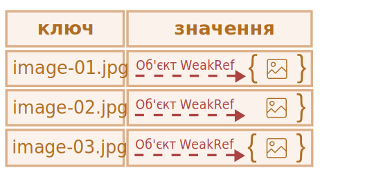
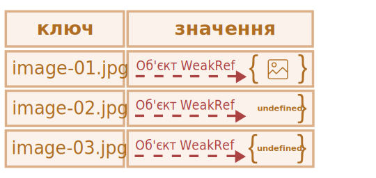
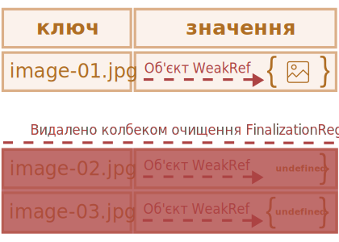
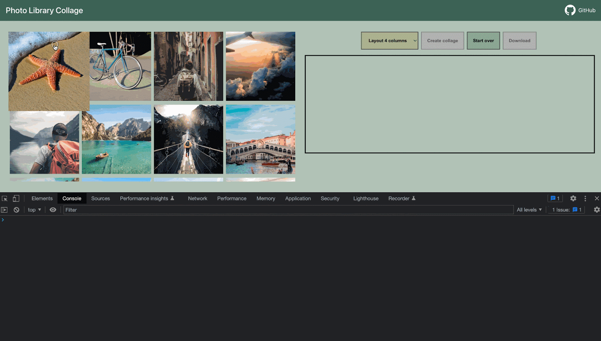
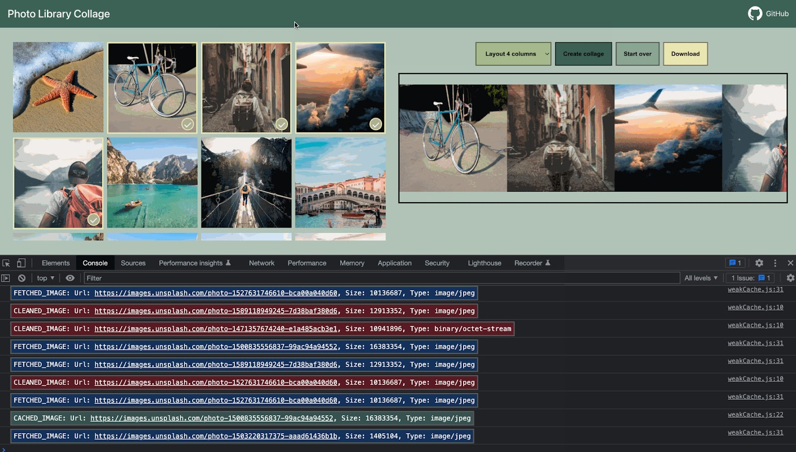

# WeakRef та FinalizationRegistry

```warn header="\"Приховані\" можливості мови"
У цій статті розглядається дуже вузькоспрямована тема, з якою більшість розробників на практиці стикаються надзвичайно рідко (а можуть і взагалі не знати про її існування).

Ми рекомендуємо пропустити цей розділ, якщо ви тільки почали вивчення JavaScript.
```

Згадуючи основну концепцію *принципу досяжності* з розділу <info:garbage-collection>, ми можемо відзначити,
що рушій JavaScript гарантовано зберігає у пам'яті значення, які досяжні або використовуються.  

Наприклад:

```js
//  у змінній user знаходиться сильне посилання на об'єкт
let user = { name: "John" };

// перезапишемо значення змінної user
user = null;

// посилання втрачається і об'єкт буде видалено з пам'яті

```
Або ж схожий, але трохи ускладнений код із двома сильними посиланнями:

```js
//  у змінній user знаходиться сильне посилання на об'єкт
let user = { name: "John" };

// скопіювали сильне посилання на об'єкт у змінну admin
*!*
let admin = user;
*/!*

// перезапишемо значення змінної user
user = null;

// об'єкт все ще доступний через змінну admin
```

Об'єкт `{ name: "John" }` видалився б із пам'яті тільки в разі відсутності сильних посилань на нього (якби ми також перезаписали значення змінної `admin`).  

У JavaScript існує концепція під назвою `WeakRef`, яка поводиться трохи інакше в цьому випадку.

````smart header="Терміни: \"Сильне посилання\", \"Слабке посилання\""
**Сильне посилання** - це посилання на об'єкт або значення, яке запобігає їх видаленню збирачем сміття.
При цьому, зберігаючи об'єкт або значення в пам'яті, на які воно вказує.  

Це означає, що об'єкт або значення залишаються в пам'яті й не видаляються збирачем сміття доти, доки на них є активні сильні посилання.  

У JavaScript стандартні посилання на об'єкти є *сильними* посиланнями. Наприклад:
```js
// змінна user містить сильне посилання на цей об'єкт
let user = { name: "John" };
```

**Слабке посилання** - це посилання на об'єкт або значення, яке *не* запобігає їх видаленню збирачем сміття. Об'єкт або значення можуть бути видалені збирачем сміття у випадку, якщо на них існують тільки слабкі посилання.
````

## WeakRef

````warn header="Застереження"
Перш ніж ми перейдемо до вивчення, варто зазначити, що правильне застосування структур,
про які йтиметься в цій статті, вимагає дуже ретельного обмірковування, і якщо це можливо, їхнього використання краще уникати.
````

`WeakRef` - це об'єкт, що містить слабке посилання на інший об'єкт, який називається `target` або `referent`.   

Особливість `WeakRef` полягає в тому, що він не перешкоджає збирачеві сміття видаляти свій об'єкт-референт. Іншими словами, він просто не утримує його "в живих".  

Тепер давайте візьмемо змінну `user` в якості "референта" і створимо слабке посилання від неї до змінної `admin`.
Щоб створити слабке посилання, необхідно використовувати конструктор `WeakRef`, передавши цільовий об'єкт (об'єкт, на який ви хочете створити слабке посилання).  

У нашому випадку — це змінна `user`:  

```js
//  у змінній user знаходиться сильне посилання на об'єкт
let user = { name: "John" };

//  у змінній admin знаходиться слабке посилання на об'єкт
*!*
let admin = new WeakRef(user);
*/!*
```

На схемі нижче зображено два типи посилань: сильне посилання з використанням змінної `user` і слабке посилання з використанням змінної `admin`:  

  

Потім, у якийсь момент, ми перестаємо використовувати змінну `user` - вона перезаписується, виходить з області видимості тощо, при цьому зберігаючи екземпляр `WeakRef` у змінній `admin`:  

```js
// перезапишемо значення змінної user
user = null;
```

Слабкого посилання на об'єкт недостатньо, щоб зберегти його "в живих".
Коли єдиними зоставшимися посиланнями на об'єкт-референт, є слабкі посилання, збирач сміття має право знищити цей об'єкт і використовувати його пам'ять для чогось іншого.  

Однак доти, доки об'єкт фактично не знищено, слабке посилання може повернути його, навіть якщо на цей об'єкт більше немає сильних посилань.
Тобто наш об'єкт стає своєрідним "[котом Шредінгера](https://uk.wikipedia.org/wiki/%D0%9A%D1%96%D1%82_%D0%A8%D1%80%D0%B5%D0%B4%D1%96%D0%BD%D0%B3%D0%B5%D1%80%D0%B0)" - ми не можемо знати точно, "живий" він чи "мертвий":  


На цьому етапі, щоб отримати об'єкт із екземпляра `WeakRef`, ми скористаємося його методом `deref()`.  

Метод `deref()` повертає об'єкт-референт, на який посилається `WeakRef`, якщо об'єкт все ще перебуває в пам'яті.
Якщо об'єкт було видалено збирачем сміття, - метод `deref()` поверне `undefined`:  

```js
let ref = admin.deref();

if (ref) {
  // об'єкт усе ще доступний: можемо здійснити будь-які маніпуляції з ним
} else {
  // об'єкт було видалено збирачем сміття
}
```

## Варіанти використання WeakRef

`WeakRef` зазвичай використовується для створення кешів або
[асоціативних масивів](https://uk.wikipedia.org/wiki/%D0%90%D1%81%D0%BE%D1%86%D1%96%D0%B0%D1%82%D0%B8%D0%B2%D0%BD%D0%B8%D0%B9_%D0%BC%D0%B0%D1%81%D0%B8%D0%B2), де зберігаються ресурсомісткі об'єкти.
Це дозволяє уникнути перешкоджанню видаленню цих об'єктів збирачем сміття тільки на основі їхньої присутності в кеші або асоціативному масиві.  

Один з основних прикладів – це ситуація, коли ми маємо велику кількість об'єктів бінарних зображень (наприклад, представлених у вигляді `ArrayBuffer` або `Blob`),
і ми хочемо зв'язати ім'я або шлях з кожним зображенням. Існуючі структури даних не зовсім підходять для цих цілей:  

- Використання `Map` для створення асоціацій між іменами та зображеннями, або навпаки, збереже об'єкти зображень у пам'яті, оскільки вони фігурують у `Map` як ключі або значення.
- `WeakMap` також не підійде в цьому випадку: через те, що об'єкти, представлені у якості ключів `WeakMap`, використовують слабкі посилання і не захищені від видалення збирачем сміття.  

Але в цій ситуації нам потрібна структура даних, яка б використовувала слабкі посилання у своїх значеннях.  

Для цього ми можемо використовувати колекцію `Map`, значеннями якої є екземпляри `WeakRef`, що посилаються на потрібні великі об'єкти.
Отже, ми не зберігатимемо в пам'яті ці великі та непотрібні об'єкти довше, ніж вимагається.  

У протилежному випадку це спосіб отримати об'єкт зображення з кешу, якщо він все ще доступний.
Якщо ж він був видалений збирачем сміття, ми згенеруємо або завантажимо його знову.  

Таким чином, у деяких ситуаціях використовується менше пам'яті.  

## Приклад №1: застосування WeakRef для кешування

Нижче міститься фрагмент коду, який демонструє техніку використання `WeakRef`.  

Коротко кажучи, ми використовуємо `Map` з строковими ключами та об'єктами `WeakRef` як їх значення.
Якщо об'єкт `WeakRef` не був видалений збирачем сміття, ми беремо його з кеша. У протилежному випадку ми завантажуємо його знову та розміщуємо в кеш для можливості подальшого повторного використання:  

```js
function fetchImg() {
  // абстрактна функція для завантаження зображень...
}

function weakRefCache(fetchImg) { // (1)
  const imgCache = new Map(); // (2)
  
  return (imgName) => { // (3)
    const cachedImg = imgCache.get(imgName); // (4)
    
    if (cachedImg?.deref()) { // (5)
      return cachedImg?.deref();
    }

    const newImg = fetchImg(imgName); // (6)
    imgCache.set(imgName, new WeakRef(newImg)); // (7)

    return newImg;
  };
}

const getCachedImg = weakRefCache(fetchImg);
```

Давайте детально розберемо все, що тут сталося:

1. `weakRefCache` - функція вищого порядку, яка приймає іншу функцію `fetchImg` як аргумент. У цьому прикладі ми можемо знехтувати докладним описом функції `fetchImg`, оскільки це може бути абсолютно будь-яка логіка завантаження зображень.
2. `imgCache` - кеш зображень, який зберігає кешовані результати функції `fetchImg`, у вигляді строкових ключів (ім'я зображення) та об'єктів `WeakRef` як їх значення.
3. Повертаємо анонімну функцію, яка приймає ім'я зображення як аргумент. Даний аргумент буде використовуватися як ключ для кешованого зображення.
4. Намагаємося отримати кешований результат з кешу, використовуючи наданий ключ (ім'я зображення).
5. Якщо кеш містить значення за вказаним ключем, і об'єкт `WeakRef` не був видалений збирачем сміття, повертаємо кешований результат.
6. Якщо в кеші немає запису із запитаним ключем, або метод `deref()` повертає `undefined` (що означає, що об'єкт `WeakRef` було видалено збирачем сміття), функція `fetchImg` завантажує зображення заново.
7. Розміщуємо завантажене зображення в кеш у вигляді `WeakRef` об'єкта.

Тепер у нас є колекція `Map`, в якій ключі – це імена зображень у вигляді рядків, а значення – це об'єкти `WeakRef`, що містять самі зображення.  

Ця техніка допомагає уникнути виділення великого об'єму пам'яті на ресурсомісткі об'єкти, які більше ніхто не використовує.
Також вона заощаджує пам'ять та час у разі повторного використання кешованих об'єктів.  

Ось візуальне відображення того, як виглядає цей код:

 

Однак, у цієї реалізації є свої недоліки: згодом `Map` буде заповнюватися рядками в якості ключів, які вказують на `WeakRef`, чий об'єкт-референт вже був видалений збирачем сміття:  



Один зі способів впоратися з цією проблемою - це періодично перевіряти кеш і видаляти "мертві" записи.
Інший спосіб - використовувати фіналізатори, з якими ми ознайомимося далі.  

## Приклад №2: застосування WeakRef для відстеження об'єктів DOM

Ще один варіант використання `WeakRef` - відстеження об'єктів DOM.  

Уявімо ситуацію, коли будь-який сторонній код або бібліотека працюють з елементами на нашій сторінці доти, доки вони існують у DOM.
Наприклад, це може бути стороння утиліта для моніторингу та сповіщень про стан системи (так званий "логер" - програма, яка надсилає інформаційні повідомлення, що називаються "логами").  

Інтерактивний приклад:

[codetabs height=420 src="weakref-dom"]

При натисканні на кнопку "Почати відправку повідомлень", у так званому "вікні відображення логів" (елемент з класом `.window__body`) починають з'являтися написи (логи).  

Але, як тільки цей елемент видалиться з DOM, логер повинен припинити надсилати повідомлення. Щоб відтворити видалення даного елемента, достатньо лише натиснути на кнопку "Закрити" у правому верхньому куті.  

Для того, щоб нам не ускладнювати роботу, і не сповіщати сторонній код кожен раз, коли наш DOM-елемент доступний, а коли – ні, достатньо буде створити на нього слабке посилання за допомогою `WeakRef`.  

Після того як елемент буде видалено з DOM, логер це побачить і припинить надсилати повідомлення.  

Тепер давайте розглянемо вихідний код детальніше (вкладка `index.js`):  

1. Отримуємо DOM-елемент кнопки "Почати відправку повідомлень".
2. Отримуємо DOM-елемент кнопки "Закрити".
3. Отримуємо DOM-елемент вікна відображення логів за допомогою конструктора `new WeakRef()`. Таким чином змінна `windowElementRef` зберігає слабке посилання на DOM-елемент.
4. Додаємо обробник подій на кнопку "Почати відправку повідомлень", який відповідає за запуск логера при натисканні.
5. Додаємо обробник подій на кнопку "Закрити", який відповідає за закриття вікна відображення логів при натисканні.
6. За допомогою `setInterval` запускаємо відображення нового повідомлення кожну секунду.
7. Якщо DOM-елемент вікна відображення логів усе ще доступний і знаходиться в пам'яті, створюємо та відправляємо нове повідомлення.
8. Якщо метод `deref()` повертає `undefined`, це означає, що DOM-елемент було видалено з пам'яті. У такому випадку логер припиняє показ повідомлень і скидає таймер.
9. `alert`, який буде викликано після того, як DOM-елемент вікна відображення логів видалиться з пам'яті (тобто після натискання на кнопку "Закрити"). **Зверніть увагу, що видалення з пам'яті може відбутися не одразу, оскільки воно залежить тільки від внутрішніх механізмів збирача сміття.**

    Ми не можемо контролювати цей процес безпосередньо з коду. Але, незважаючи на це, у нас все ще є можливість виконати примусовий збір сміття з браузера. 

   У Google Chrome, наприклад, для цього потрібно відкрити інструменти розробника (`key:Ctrl` + `key:Shift` + `key:J` на Windows/Linux або `key:Option` + `key:⌘` + `key:J` на macOS), перейти до вкладки "Продуктивність (Performance)" та натиснути на кнопку з іконкою урни – "Зібрати сміття (Collect garbage)":  

      

    Даний функціонал підтримується у більшості сучасних браузерів. Після виконаних дій <code>alert</code> спрацює невідкладно.

## FinalizationRegistry

А тепер настав час поговорити про фіналізатори. Перш ніж ми перейдемо далі, давайте розберемося з термінологією:  

**Колбек очищення (фіналізатор)** - це функція, яка виконується у випадку, якщо об'єкт, зареєстрований в `FinalizationRegistry`, видаляється з пам'яті збирачем сміття.  

Його мета – надати можливість виконання додаткових операцій, пов'язаних з об'єктом, після його остаточного видалення з пам'яті.  

**Реєстр** (або `FinalizationRegistry`) - це спеціальний об'єкт у JavaScript, який керує реєстрацією та скасуванням реєстрації об'єктів та їх колбеків очищення.  

Цей механізм дозволяє зареєструвати об'єкт для відстеження і пов'язати з ним колбек очищення.
По суті, це структура, яка зберігає інформацію про зареєстровані об'єкти та їх колбеки очищення, а потім автоматично викликає ці колбеки при видаленні об'єктів з пам'яті.  

Для створення екземпляра реєстру `FinalizationRegistry`, необхідно викликати його конструктор,
який приймає єдиний аргумент - колбек очищення (фіналізатор).

Синтаксис:

```js
function cleanupCallback(heldValue) { 
  // код колбека очищення 
}

const registry = new FinalizationRegistry(cleanupCallback);
```

Тут:

- `cleanupCallback` - колбек очищення, який буде автоматично викликаний при видаленні зареєстрованого об'єкта з пам'яті.
- `heldValue` - значення, яке передається як аргумент для колбека очищення. Якщо `heldValue` є об'єктом, реєстр зберігає на нього сильне посилання.
- `registry` - екземпляр `FinalizationRegistry`.

Методи `FinalizationRegistry`:

- `register(target, heldValue [, unregisterToken])` - використовується для реєстрації об'єктів у реєстрі.

  `target` - об'єкт, що реєструється для відстеження. Якщо `target` буде видалено збирачем сміття, колбек очищення буде викликано з `heldValue` як аргумент.

  Опціональний `unregisterToken` -  токен скасування реєстрації. Може бути переданий для скасування реєстрації до видалення об'єкта збирачем сміття. Зазвичай як `unregisterToken` використовується об'єкт `target`, що є стандартною практикою.
- `unregister(unregisterToken)` - метод `unregister` використовується для скасування реєстрації об'єкта в реєстрі. Він приймає один аргумент - `unregisterToken` (токен скасування реєстрації, який був отриманий під час реєстрації об'єкта).    

Тепер перейдемо до простого прикладу. Скористаємося вже відомим нам об'єктом `user` і створимо екземпляр `FinalizationRegistry`:  

```js
let user = { name: "John" };

const registry = new FinalizationRegistry((heldValue) => {
  console.log(`${heldValue} був видалений збирачем сміття.`);
});
```

Потім зареєструємо об'єкт, для якого потрібен колбек очищення, викликавши метод `register`:

```js
registry.register(user, user.name);
```

Реєстр не зберігає сильне посилання на об'єкт, що реєструється, оскільки це б суперечило його призначенню.
Якби реєстр зберігав сильне посилання, то об'єкт ніколи б не був очищений збирачем сміття.  

Якщо ж об'єкт видаляється збирачем сміття, наш колбек очищення може бути викликаний в якийсь момент у майбутньому, з переданим йому `heldValue`:

```js
// Коли об'єкт user видалиться збирачем сміття, у консоль буде виведено повідомлення:
"John був видалений збирачем сміття."
```

Також існують ситуації, коли навіть у реалізаціях, де використовується колбек очищення, є ймовірність, що він не буде викликаний.  

Наприклад:
- Коли програма повністю завершує свою роботу (наприклад, під час закриття вкладки в браузері). 
- Коли сам екземпляр `FinalizationRegistry` більше не доступний для JavaScript коду.
  Якщо об'єкт, що створює екземпляр `FinalizationRegistry`, виходить з області видимості або видаляється, то колбеки очищення, зареєстровані в цьому реєстрі, також можуть бути не викликані.  

## Кешування с FinalizationRegistry

Повертаючись до нашого прикладу *слабкого* кешу, ми можемо помітити наступне:
- Незважаючи на те, що значення, обгорнуті у `WeakRef`, були зібрані збирачем сміття, все ще актуальна проблема "витоку пам'яті" у вигляді ключів, що залишилися, значення яких були зібрані збирачем сміття.

Ось покращений приклад кешування, у якому використовується `FinalizationRegistry`:

```js
function fetchImg() {
  // абстрактна функція для завантаження зображень...
}

function weakRefCache(fetchImg) {
  const imgCache = new Map();

  *!*
  const registry = new FinalizationRegistry((imgName) => { // (1)
    const cachedImg = imgCache.get(imgName);
    if (cachedImg && !cachedImg.deref()) imgCache.delete(imgName);
  });
  */!*

  return (imgName) => {
    const cachedImg = imgCache.get(imgName);
    
    if (cachedImg?.deref()) {
      return cachedImg?.deref();
    }

    const newImg = fetchImg(imgName);
    imgCache.set(imgName, new WeakRef(newImg));
    *!*
    registry.register(newImg, imgName); // (2)
    */!*

    return newImg;
  };
}

const getCachedImg = weakRefCache(fetchImg);
```

1. Для керування очищенням "мертвих" записів у кеші, коли пов'язані з ними об'єкти `WeakRef` збираються збирачем сміття, створюємо реєстр очищення `FinalizationRegistry`.

   Важливим моментом тут є те, що в колбеку очищення повинно перевірятися, чи був запис видалений збирачем сміття і чи не був доданий заново, щоб не видалити "живий" запис. 
2. Після завантаження і встановлення нового значення (зображення) в кеш, реєструємо його в реєстрі фіналізатора для відстеження об'єкта `WeakRef`.  

Ця реалізація містить тільки актуальні або "живі" пари ключ/значення.
У цьому випадку кожен об'єкт `WeakRef` зареєстрований у `FinalizationRegistry`.
А після того, як об'єкти будуть очищені збирачем сміття, колбек очищення видалить всі значення `undefined`.

Ось візуальне відображення оновленого коду:



Ключовим аспектом в оновленій реалізації є те, що фіналізатори дають змогу створювати паралельні процеси між "основною" програмою та колбеками очищення.
У контексті JavaScript, "основна" програма - це наш JavaScript-код, який запускається і виконується в нашому застосунку або на веб-сторінці.  

Отже, з моменту, коли об'єкт позначається для видалення збирачем сміття, до фактичного виконання колбека очищення, може виникнути певний проміжок часу.
Важливо розуміти, що в цьому часовому інтервалі основна програма може внести будь-які зміни в об'єкт або навіть повернути його назад у пам'ять.  

Тому в колбеку очищення ми повинні перевірити, чи не було запис додано назад у кеш основною програмою, щоб уникнути видалення "живих" записів.
Аналогічно, під час пошуку ключа в кеші існує ймовірність того, що значення було видалено збирачем сміття, але колбек очищення ще не було виконано.  

Такі ситуації потребують особливої уваги, якщо ви працюєте з `FinalizationRegistry`.

## Використання WeakRef і FinalizationRegistry на практиці

Переходячи від теорії до практики, уявіть собі реальний сценарій, коли користувач синхронізує свої фотографії на мобільному пристрої
з якимось хмарним сервісом (як-от [iCloud](https://uk.wikipedia.org/wiki/ICloud) або [Google Photos](https://uk.wikipedia.org/wiki/Google_%D0%A4%D0%BE%D1%82%D0%BE)), і хоче переглядати їх з інших пристроїв.
Подібні сервіси крім основного функціоналу перегляду фотографій, пропонують масу додаткових можливостей, наприклад:

- Редагування фотографій та відео ефекти.
- Створення «спогадів» та альбомів. 
- Монтаж відео з серії фотографій. 
- ...і багато іншого.  

Як приклад тут ми використовуватимемо досить примітивну реалізацію такого сервісу.
Основна суть - показати можливий сценарій спільного використання `WeakRef` і `FinalizationRegistry` в реальному житті.  

Ось як це виглядає:


У лівій частині знаходиться хмарна бібліотека фотографій (вони відображаються у вигляді мініатюр).
Ми можемо вибрати потрібні нам зображення і створити колаж, натиснувши на кнопку "Create collage" у правій частині сторінки.
Потім, отриманий результат можна буде завантажити у вигляді зображення.  

Для збільшення швидкості завантаження сторінки розумно буде завантажувати і показувати мініатюри фотографій саме в *стислій* якості.
Але, для створення колажу з обраних фотографій, завантажувати і використовувати їх у *повнорозмірній* якості.  

Нижче ми бачимо, що внутрішній розмір мініатюр становить 240×240 пікселів.
Розмір був обраний спеціально для збільшення швидкості завантаження.
Крім того, нам не потрібні повнорозмірні фотографії в режимі попереднього перегляду.


Припустимо, що нам потрібно створити колаж із 4 фотографій: ми вибираємо їх, після чого натискаємо кнопку "Create collage".
На цьому етапі вже відома нам функція <code>weakRefCache</code> перевіряє, чи є потрібне зображення в кеші.
Якщо ні, то завантажує його з хмари і розміщує в кеш для можливості подальшого використання. І так відбувається для кожного обраного зображення:  



Звернувши увагу на вивід у консолі, можна побачити, які з фотографій були завантажені з хмари - на це вказує <span style="background-color:#133159;color:white;font-weight:500">FETCHED_IMAGE</span>.
Оскільки це перша спроба створення колажу, це означає, що на даному етапі "слабкий кеш" ще був порожній, а всі фотографії були завантажені з хмари і розміщені в нього.  

Але, поряд із процесом завантаження зображень, відбувається ще й процес очищення пам'яті збирачем сміття.
Це означає, що об'єкт, який зберігається в кеші і на який ми посилаємося, використовуючи слабке посилання, видаляється збирачем сміття.
І наш фіналізатор виконується успішно, тим самим видаляючи ключ, за яким зображення зберігалося в кеші. Про це нас повідомляє <span style="background-color:#901e30;color:white;font-weight:500;">CLEANED_IMAGE</span>:

  

Далі ми розуміємо, що нам не подобається отриманий колаж, і вирішуємо змінити одне із зображень і створити новий.
Для цього достатньо зняти виділення з непотрібного зображення, вибрати інше, та ще раз натиснути на кнопку "Create collage":

  

Але, цього разу не всі зображення були викачані з мережі, і одне з них було взяте зі слабкого кешу: про це нам говорить повідомлення <span style="background-color:#385950;color:white;font-weight:500;">CACHED_IMAGE</span>.
Це означає, що на момент створення колажу збирач сміття ще не видалив наше зображення, і ми сміливо взяли його з кеша,
тим самим скоротивши кількість мережевих запитів і прискоривши загальний час процесу створення колажу:  



Давайте ще трохи "пограємо", замінивши одне із зображень ще раз і створивши новий колаж:  

  

Цього разу результат ще більш значний. З 4 обраних зображень, 3 з них були взяті зі слабкого кешу, і тільки одне довелося завантажити з мережі.
Зниження навантаження на мережу склало близько 75%. Вражає, чи не так?  


Звісно, не слід забувати, що така поведінка не є гарантованою, і залежить від конкретної реалізації та роботи збирача сміття.  

Виходячи з цього, одразу ж виникає цілком логічне запитання: чому б нам не використати звичайний кеш, де ми можемо самі керувати його сутностями, а не покладатися на збирач сміття?
Все вірно, у більшості випадків немає необхідності використовувати `WeakRef` і `FinalizationRegistry`.  

Тут ми просто продемонстрували альтернативну реалізацію подібного функціоналу, використовуючи нетривіальний підхід із цікавими особливостями мови.
Тим не менш, ми не можемо покладатися на цей приклад, якщо нам необхідний постійний і передбачуваний результат.

Ви можете [відкрити цей приклад у пісочниці](sandbox:weakref-finalizationregistry).

## Отже:
`WeakRef` - призначений для створення слабких посилань на об'єкти, що дозволяє їм бути видаленими з пам'яті збирачем сміття, якщо на них більше немає сильних посилань.
Це корисно для розв'язання проблеми надмірного використання пам'яті та оптимізації використання системних ресурсів у додатках.  

`FinalizationRegistry` - це засіб реєстрації колбеків, які виконуються під час знищення об'єктів, на які більше немає сильних посилань. Це дає змогу звільняти пов'язані з об'єктом ресурси або виконувати інші необхідні операції перед видаленням об'єкта з пам'яті.
