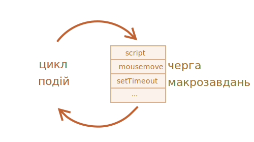
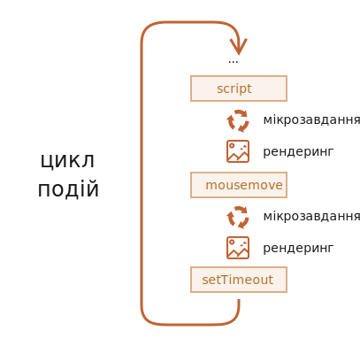

# Цикл подій: мікрозавдання та макрозавдання

Потік виконання JavaScript в браузері, так само як і в Node.js, базується на *циклі подій*.

Розуміння принципу роботи циклу подій важливе для оптимізації, та іноді для правильної архітектури.

В цьому розділі ми спочатку розглянемо теоретичну базу, а потім практичне застосування цих знань.

## Цикл подій

Концепція *циклу подій* дуже проста. Існує нескінченний цикл, в якому рушій JavaScript очікує завдання, виконує їх, а потім переходить в режим очікування нових завдань.

Загальний алгоритм рушія:

1. Поки є завдання:
    - виконати їх, починаючи з найстарішого.
2. Очікувати поки завдання не з'явиться, потім перейти до пункту 1.

Це формалізація того, що ми бачимо, гортаючи веб-сторінку. Рушій JavaScript більшість часу не робить нічого, він працює лише коли спрацьовує скрипт, обробник подій чи подія.

Приклади завдань:

- Коли завантажується зовнішній скрипт `<script src="...">`, тоді завдання полягає в виконанні цього скрипта.
- Коли користувач рухає мишкою, тоді завдання згенерувати подію `mousemove` і виконати її обробники.
- Коли пройде час, запрограмований в `setTimeout`, тоді завдання запустити його колбек.
- ...і так далі.

З’являються задачі для виконання -- рушій виконує їх -- потім очікує нових завдань (майже не навантажуючи процесор в режимі очікування).

Може трапитись так, що завдання приходить тоді, коли рушій вже зайнятий, тоді це завдання стає в чергу.

Чергу з таких завдань називають "чергою макрозавдань" ("macrotask queue", термін v8):



Наприклад, поки рушій виконує `script`, користувач може порухати мишкою, що спричинить появу події `mousemove`, та може вийти час, запрограмований в `setTimeout` і так далі. Ці завдання сформують чергу, як показано на схемі вище.

Задачі з черги виконуються за правилом "перший прийшов – перший пішов". Коли рушій браузера закінчить виконання `script`, він обробить подію `mousemove`, потім виконає обробник `setTimeout`, і так далі.

Доволі просто наразі, чи не так?

Ще декілька деталей:
1. Рендеринг ніколи не відбувається поки рушій виконує завдання. Не має значення наскільки довго виконується завдання. Зміни в DOM будуть відмальовані лише після завершення завдання.
2. Якщо виконання завдання займає надто багато часу, браузер не зможе виконувати інші завдання, наприклад, обробляти користувацькі події. Тож після недовгого часу "зависання" з'явиться оповіщення "Сторінка не відповідає" і пропозиція вбити процес виконання завдання разом з цілою сторінкою. Таке трапляється коли код містить багато складних обрахунків або виникає програмна помилка, що створює нескінченний цикл.

Що ж, це була теорія. Тепер побачимо як можна використати ці знання на практиці.

## Приклад 1: розбиття ресурсозатратних завдань

Припустимо у нас є завдання, що потребує значних ресурсів процесора.

Наприклад, підсвічування синтаксису (використовується для виділення кольором коду на цій сторінці) доволі важке завдання для процесора. Щоб розмалювати код, процесор його аналізує, створює багато кольорових елементів, додає їх в документ -- для великих об'ємів тексту це займає багато часу.

Поки рушій зайнятий підсвічуванням синтаксису він не може виконувати інші речі, пов'язані з DOM, обробляти користувацькі події тощо. Це може спричинити "зависання" браузера, що є неприйнятним.

Ми можемо уникнути проблем шляхом розбивання великого завдання на шматочки. Підсвітити перші 100 рядків, потім поставити `setTimeout` (з нульовою затримкою) для наступних 100 рядків і так далі.

Щоб продемонструвати такий підхід, замість підсвічування для спрощення візьмемо функцію, яка рахує від `1` до `1000000000`.

Якщо ви запустите код нижче, рушій "зависне" на деякий час. Для серверного JS це буде явно видно, а якщо ви запускаєте це в браузері, то спробуйте понатискати інші кнопки на сторінці -- ви побачите, що жодна з подій не спрацює поки рахунок не завершиться.

```js run
let i = 0;

let start = Date.now();

function count() {

  // робимо важку роботу
  for (let j = 0; j < 1e9; j++) {
    i++;
  }

  alert("Виконано за " + (Date.now() - start) + 'мс');
}

count();
```

Браузер навіть може показати повідомлення "скрипт виконується надто довго".

Давайте розіб'ємо роботу на частини, використавши вкладені виклики `setTimeout`:

```js run
let i = 0;

let start = Date.now();

function count() {

  // робимо частину важкої роботи (*)
  do {
    i++;
  } while (i % 1e6 != 0);

  if (i == 1e9) {
    alert("Done in " + (Date.now() - start) + 'ms');
  } else {
    setTimeout(count); // плануємо новий виклик (**)
  }

}

count();
```

Тепер інтерфейс браузера повністю робочий під час виконання процесу "обчислення".

Простий виклик `count` робить частину роботи `(*)`, і потім планує свій же виклик `(**)`, якщо це необхідно:

1. Перше виконання обчислює: `i=1...1000000`.
2. Друге виконання обчислює: `i=1000001..2000000`.
3. ...і так далі.

Тепер, якщо з'являється нове стороннє завдання (таке як подія `onclick`) поки рушій виконує частину 1, воно стає в чергу і виконується після закінчення частини 1, перед наступною частиною. Періодичні повернення в цикл подій між виконанням `count` дають рушію достатньо "простору", щоб зробити щось іще, відреагувати на дії користувача.

Примітна річ, що обидва варіанти -- з розбиттям і без розбиття роботи з `setTimeout` -- майже не відрізняються за швидкістю. Немає великої різниці в загальному часі підрахунку.

Щоб зменшити цю різницю ще сильніше, давайте внесемо покращення.

Ми перенесемо планування виклику в початок `count()`:

```js run
let i = 0;

let start = Date.now();

function count() {

  // переносимо планування виклику в початок
  if (i < 1e9 - 1e6) {
    setTimeout(count); // плануємо новий виклик
  }

  do {
    i++;
  } while (i % 1e6 != 0);

  if (i == 1e9) {
    alert("Виконано за " + (Date.now() - start) + 'мс');
  }

}

count();
```

Тепер коли ми викликаємо `count()` і бачимо, що нам потрібно викликати `count()` ще, ми плануємо це негайно, ще перед тим як виконувати роботу.

Якщо ви запустите це, то легко зауважите, що виконання займає значно менше часу.

Чому?  

Все просто: як ви знаєте, в браузера є мінімальна затримка в 4мс при багатьох вкладених викликах `setTimeout`. Навіть якщо ми встановимо `0`, насправді це буде `4ms` (або трохи більше). Тож чим раніше ми заплануємо виклик - тим швидше виконається код.

Отож, ми розбили ресурсозатратне завдання на частини - тепер воно не буде блокувати користувацький інтерфейс. І загальний час виконання практично не збільшиться.

## Use case 2: progress indication

Another benefit of splitting heavy tasks for browser scripts is that we can show progress indication.

As mentioned earlier, changes to DOM are painted only after the currently running task is completed, irrespective of how long it takes.

On one hand, that's great, because our function may create many elements, add them one-by-one to the document and change their styles -- the visitor won't see any "intermediate", unfinished state. An important thing, right?

Here's the demo, the changes to `i` won't show up until the function finishes, so we'll see only the last value:


```html run
<div id="progress"></div>

<script>

  function count() {
    for (let i = 0; i < 1e6; i++) {
      i++;
      progress.innerHTML = i;
    }
  }

  count();
</script>
```

...But we also may want to show something during the task, e.g. a progress bar.

If we split the heavy task into pieces using `setTimeout`, then changes are painted out in-between them.

This looks prettier:

```html run
<div id="progress"></div>

<script>
  let i = 0;

  function count() {

    // do a piece of the heavy job (*)
    do {
      i++;
      progress.innerHTML = i;
    } while (i % 1e3 != 0);

    if (i < 1e7) {
      setTimeout(count);
    }

  }

  count();
</script>
```

Now the `<div>` shows increasing values of `i`, a kind of a progress bar.


## Use case 3: doing something after the event

In an event handler we may decide to postpone some actions until the event bubbled up and was handled on all levels. We can do that by wrapping the code in zero delay `setTimeout`.

In the chapter <info:dispatch-events> we saw an example: custom event `menu-open` is dispatched in `setTimeout`, so that it happens after the "click" event is fully handled.

```js
menu.onclick = function() {
  // ...

  // create a custom event with the clicked menu item data
  let customEvent = new CustomEvent("menu-open", {
    bubbles: true
  });

  // dispatch the custom event asynchronously
  setTimeout(() => menu.dispatchEvent(customEvent));
};
```

## Macrotasks and Microtasks

Along with *macrotasks*, described in this chapter, there are *microtasks*, mentioned in the chapter <info:microtask-queue>.

Microtasks come solely from our code. They are usually created by promises: an execution of `.then/catch/finally` handler becomes a microtask. Microtasks are used "under the cover" of `await` as well, as it's another form of promise handling.

There's also a special function `queueMicrotask(func)` that queues `func` for execution in the microtask queue.

**Immediately after every *macrotask*, the engine executes all tasks from *microtask* queue, prior to running any other macrotasks or rendering or anything else.**

For instance, take a look:

```js run
setTimeout(() => alert("timeout"));

Promise.resolve()
  .then(() => alert("promise"));

alert("code");
```

What's going to be the order here?

1. `code` shows first, because it's a regular synchronous call.
2. `promise` shows second, because `.then` passes through the microtask queue, and runs after the current code.
3. `timeout` shows last, because it's a macrotask.

The richer event loop picture looks like this (order is from top to bottom, that is: the script first, then microtasks, rendering and so on):



All microtasks are completed before any other event handling or rendering or any other macrotask takes place.

That's important, as it guarantees that the application environment is basically the same (no mouse coordinate changes, no new network data, etc) between microtasks.

If we'd like to execute a function asynchronously (after the current code), but before changes are rendered or new events handled, we can schedule it with `queueMicrotask`.

Here's an example with "counting progress bar", similar to the one shown previously, but `queueMicrotask` is used instead of `setTimeout`. You can see that it renders at the very end. Just like the synchronous code:

```html run
<div id="progress"></div>

<script>
  let i = 0;

  function count() {

    // do a piece of the heavy job (*)
    do {
      i++;
      progress.innerHTML = i;
    } while (i % 1e3 != 0);

    if (i < 1e6) {
  *!*
      queueMicrotask(count);
  */!*
    }

  }

  count();
</script>
```

## Summary

A more detailed event loop algorithm (though still simplified compared to the [specification](https://html.spec.whatwg.org/multipage/webappapis.html#event-loop-processing-model)):

1. Dequeue and run the oldest task from the *macrotask* queue (e.g. "script").
2. Execute all *microtasks*:
    - While the microtask queue is not empty:
        - Dequeue and run the oldest microtask.
3. Render changes if any.
4. If the macrotask queue is empty, wait till a macrotask appears.
5. Go to step 1.

To schedule a new *macrotask*:
- Use zero delayed `setTimeout(f)`.

That may be used to split a big calculation-heavy task into pieces, for the browser to be able to react to user events and show progress between them.

Also, used in event handlers to schedule an action after the event is fully handled (bubbling done).

To schedule a new *microtask*
- Use `queueMicrotask(f)`.
- Also promise handlers go through the microtask queue.

There's no UI or network event handling between microtasks: they run immediately one after another.

So one may want to `queueMicrotask` to execute a function asynchronously, but within the environment state.

```smart header="Web Workers"
For long heavy calculations that shouldn't block the event loop, we can use [Web Workers](https://html.spec.whatwg.org/multipage/workers.html).

That's a way to run code in another, parallel thread.

Web Workers can exchange messages with the main process, but they have their own variables, and their own event loop.

Web Workers do not have access to DOM, so they are useful, mainly, for calculations, to use multiple CPU cores simultaneously.
```
